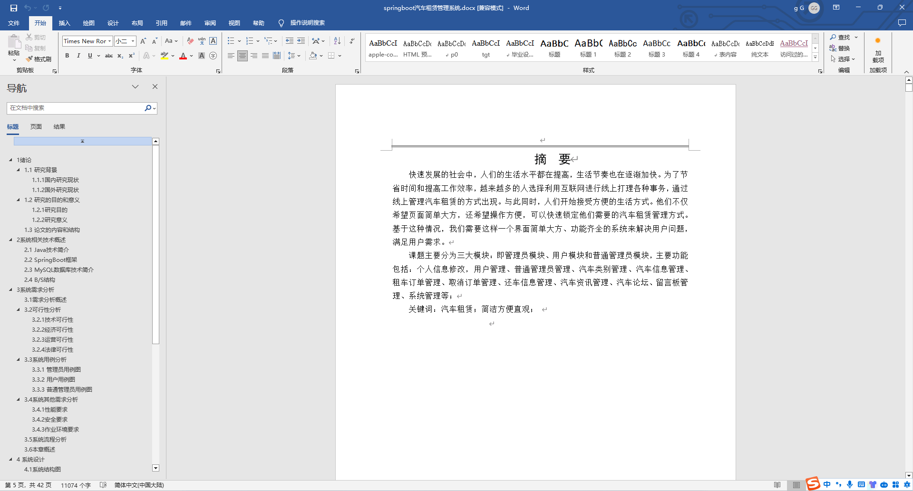
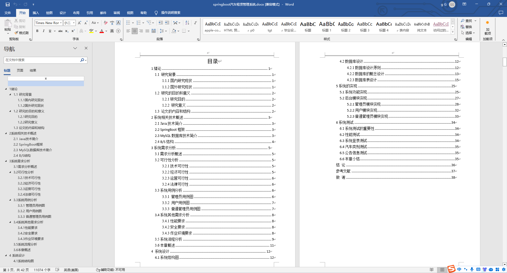
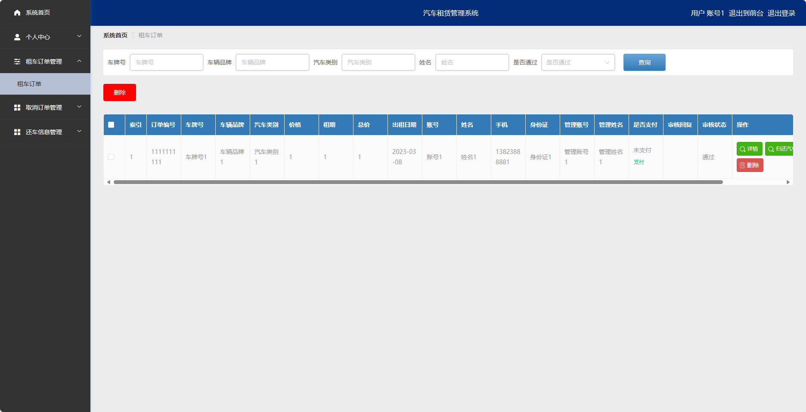
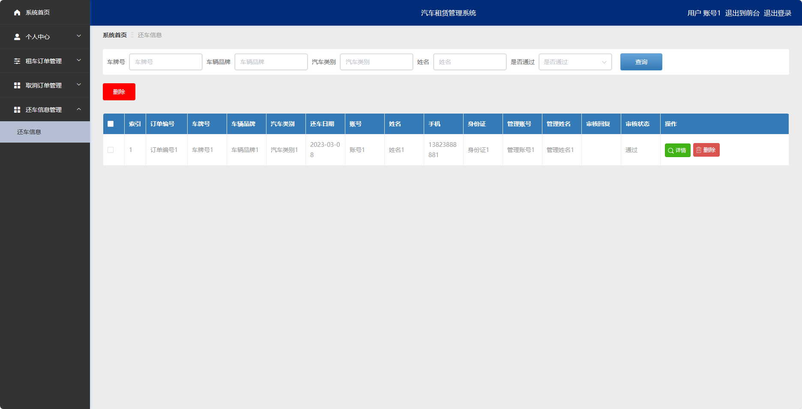
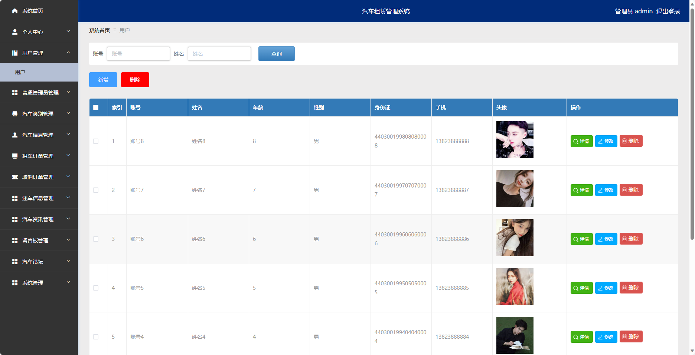

基于SpringBoot的汽车租赁管理系统（程序+论文）
=
- 完整代码获取地址：从戎源码网 ([https://armycodes.com/](https://armycodes.com/))
- 作者微信：19941326836  QQ：952045282 
- 承接计算机毕业设计、Java毕业设计、Python毕业设计、深度学习、机器学习
- 选题+开题报告+任务书+程序定制+安装调试+论文+答辩ppt 一条龙服务
- 所有选题地址https://github.com/nature924/allProject

一、项目介绍
---
基于Spring Boot框架实现的汽车租赁管理系统，系统包含两种角色：管理员、用户,系统分为前台和后台两大模块，主要功能如下。

### 前台:
- 首页：展示系统的概览信息。
- 汽车信息：展示可租赁的汽车的品牌、型号、价格等信息。
- 汽车资讯：提供最新的汽车行业资讯、车型评测、保养知识等。
- 汽车论坛：用户可以在这里发布自己的汽车使用心得、交流汽车相关的话题等。
- 公告信息：系统管理员可以发布一些重要的系统公告信息。
- 留言板：提供用户反馈系统问题、意见建议等。

### 后台：
### 管理员角色：
- 个人中心：管理员可以管理个人信息，修改密码等。
- 用户管理：管理员可以管理用户信息，包括查看用户列表、添加、编辑、删除等操作。
- 普通管理员管理：管理员可以管理普通管理员信息，包括查看管理员列表、添加、编辑、删除等操作。
- 汽车类别管理：管理员可以管理汽车的类别信息，包括查看分类列表、添加、编辑、删除等操作。
- 汽车信息管理：管理员可以管理可租赁的汽车信息，包括查看汽车列表、添加、编辑、删除等操作。
- 租车订单管理：管理员可以管理用户的租车订单信息，包括查看订单列表、处理订单状态等操作。
- 取消订单管理：管理员可以管理用户的取消订单信息，包括查看订单列表、处理订单状态等操作。
- 还车信息管理：管理员可以管理用户的还车信息，包括查看还车列表、处理还车状态等操作。
- 汽车资讯管理：管理员可以管理汽车行业资讯、车型评测、保养知识等，包括查看、添加、编辑、删除等操作。
- 留言板管理：管理员可以管理留言板信息，包括查看留言列表、删除留言等操作。
- 汽车论坛：管理员可以管理汽车论坛信息，包括查看帖子列表、删除帖子等操作。
- 系统管理：管理员可以管理系统的参数设置、日志查看等功能。

### 普通管理员角色：
- 个人中心：管理员可以管理个人信息，包括修改密码等。
- 汽车信息管理：管理员可以管理可租赁的汽车信息，包括查看汽车列表、添加、编辑、删除等操作。
- 租车订单管理：管理员可以管理用户的租车订单信息，包括查看订单列表、处理订单状态等操作。
- 取消订单管理：管理员可以管理用户的取消订单信息，包括查看订单列表、处理订单状态等操作。
- 还车信息管理：管理员可以管理用户的还车信息，包括查看还车列表、处理还车状态等操作。
- 汽车资讯管理：管理员可以管理汽车行业资讯、车型评测、保养知识等，包括查看、添加、编辑、删除等操作。

### 用户角色：
- 个人中心：用户可以管理个人信息，包括修改密码等。
- 租车订单管理：用户可以查看自己的租车订单信息，包括已租赁的汽车订单详情。
- 取消订单管理：用户可以查看自己的取消订单信息，包括已取消的汽车订单详情。
- 还车信息管理：用户可以提交还车信息，包括还车时间、还车地点等。

二、项目技术
---
- 编程语言：Java
- 数据库：MySQL
- 项目管理工具：Maven
- 前端技术：VUE、HTML、Jquery、Bootstrap
- 后端技术：Spring、SpringMVC、MyBatis

三、运行环境
---
- 操作系统：Windows、macOS都可以
- JDK版本：JDK1.8以上都可以
- 开发工具：IDEA、Ecplise、Myecplise都可以
- 数据库: MySQL5.7以上都可以
- Tomcat：任意版本都可以
- Maven：任意版本都可以

四、运行截图
---
### 论文截图：

### 程序截图：

